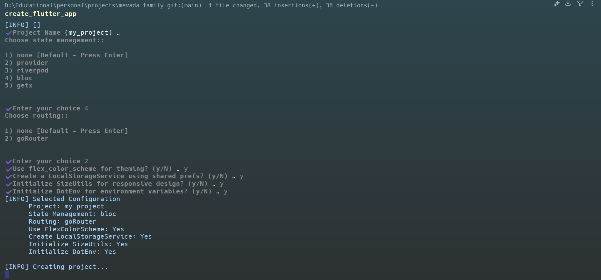

# create_flutter_app

A simple CLI tool to scaffold Flutter projects with custom setups. Inspired by `create-t3-app`, but built for Flutter!

---

## 🚀 Features

- Interactive prompts to configure your Flutter project
- Non-interactive mode via CLI flags for scripting and automation
- Dry-run mode to preview what would be generated without touching the file system
- State management scaffolding: Provider, Riverpod, or BLoC/Cubit
- Routing scaffolding: GoRouter or AutoRoute
- Optional `flex_color_scheme` theming setup
- Optional `LocalStorageService` using `shared_preferences`
- Optional `SizeUtils` helper for responsive design
- Optional `flutter_dotenv` environment variable setup
- Standard `lib/` folder structure (features, models, services, utils, constants)
- One-liner setup from anywhere

---

## 🧪 Getting Started

### Check it out on pub.dev

You can find the `create_flutter_app` package on [pub.dev](https://pub.dev/packages/create_flutter_app).

### Install globally

To use the CLI tool, you need to activate it globally using Dart's package manager:

```sh
dart pub global activate create_flutter_app
```

### Usage

Once installed, you can run the tool from any directory:

```sh
create_flutter_app
```

This will start an interactive prompt that guides you through the project setup.

You can also pass flags to skip individual prompts or run fully non-interactively:

```sh
create_flutter_app --name my_app --state-management riverpod --routing goRouter --flex-color-scheme
```

---

## ⚙️ CLI Options

| Flag / Option | Short | Description |
|---|---|---|
| `--help` | `-h` | Show the help message and exit. |
| `--version` | `-v` | Print the tool version and exit. |
| `--dry-run` | | Print what would be created without running any commands or writing any files. |
| `--name <name>` | `-n` | Project name (snake_case). Skips the interactive name prompt. |
| `--state-management <option>` | `-s` | State management solution (`none`, `provider`, `riverpod`, `bloc`). |
| `--routing <option>` | `-r` | Routing solution (`none`, `goRouter`, `autoRoute`). |
| `--flex-color-scheme` | | Include `flex_color_scheme` for theming. |
| `--local-storage` | | Generate a `LocalStorageService` using `shared_preferences`. |
| `--size-utils` | | Generate a `SizeUtils` helper for responsive design. |
| `--dotenv` | | Generate a `.env` file and `flutter_dotenv` setup. |

---

## 🎛️ Interactive Prompts

When running without flags, `create_flutter_app` guides you through the following choices:

- **Project Name:** The name of your new Flutter project (snake_case). Used as the directory name.
- **State Management:** Choose your preferred state management solution:
  - `none`: No specific state management boilerplate.
  - `provider`: Integrates the `provider` package for simple state management.
  - `riverpod`: Sets up `flutter_riverpod` using the modern `NotifierProvider` API.
  - `bloc`: Configures the project with `flutter_bloc` and a `CounterCubit` example.
- **Routing:** Select a routing solution for navigation:
  - `none`: Basic Flutter Navigator 1.0.
  - `goRouter`: Integrates the `go_router` package for declarative routing.
  - `autoRoute`: Integrates the `auto_route` package with code generation support.
- **Use `flex_color_scheme` for theming:** (yes/no)
  - If `yes`, includes `flex_color_scheme` with a pre-configured light and dark `AppTheme`.
- **Create a `LocalStorageService` using `shared_preferences`:** (yes/no)
  - If `yes`, generates a type-safe `LocalStorageService` wrapper around `shared_preferences`.
- **Initialize `SizeUtils` for responsive design:** (yes/no)
  - If `yes`, generates a `SizeUtils` helper that scales dimensions relative to a design baseline.
- **Initialize `flutter_dotenv` for environment variables:** (yes/no)
  - If `yes`, adds a `.env` file (pre-added to `.gitignore`) and the necessary `flutter_dotenv` setup.

---

**Example Usage (GIF/Screenshot Placeholder):**

